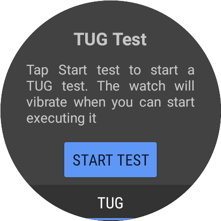
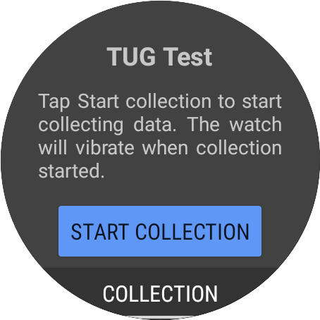
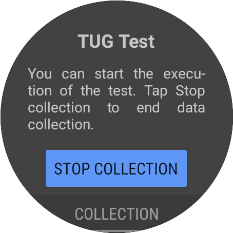

# TUG Test Smartwatch

[](https://zenodo.org/badge/latestdoi/449254217)

This WearOS application allows the data collection of accelerometer and gyroscope samples from
a smartwatch and send it to the companion app, [TUG Test Smartphone](https://github.com/matey97/TugTestSmartphone) 
running in the paired smartphone. That application uses the collected data to automatically extract 
the results of the execution of the TUG test.

The application has to functioning modes. In both modes, the application collects data from the 
accelerometer and gyroscope of the device and sends it to the smartphone. 
The changing behaviour is what is done with that data in the smartphone:

- TUG: the data is processed and used in a machine learning model to estimate the current activity
  being performed by the user. This is the mode to be used to execute the TUG test and automatically get
  its results with the smartphone application.
- COLLECTION: the data is stored in a file to be used later for diverse purposes (e.g., analysis, processing, model training, etc...)

This application is part of the system developed and described in the AIME 2022 conference paper 
*Instrumented Timed Up and Go test using inertial sensors from consumer wearable devices* [[1]](#1).

## Requirements
The usage of this application has some hardware and software requirements:

### Hardware
- Android smartwatch with Wear OS 2.0 or superior.
- Android smartphone with Android 6.0 (Marshmallow) or superior.
- Devices must be paired: install the [Smartwatch Wear OS by Google](https://play.google.com/store/apps/details?id=com.google.android.wearable.app&hl=es&gl=US)
  app in the smartphone and go through the pairing process.

While the last two are not hard requirements (i.e., you can still run the application without a linked smartphone), the
smartwatch application on its own offers no functionality (i.e., apps complement themselves).

### Software requirements
- The paired smartwatch must have installed the [TUG Test Smartphone](https://github.com/matey97/TugTestSmartphone).
- Android Studio(see [Install Android Studio](#install-android-studio))

## Environment setup

### Clone repository
Download this repository as a ZIP and extract it or clone it executing:

```bash
git clone https://github.com/matey97/TugTestSmartwatch.git
```

### Install Android Studio
[Download and install Android Studio](https://developer.android.com/studio) (if not installed already)

## Deploy application
- Connect your Android smartwatch (with Developer Options > USB Debugging enabled) 
  through [WiFi](https://developer.android.com/training/wearables/get-started/debugging#wifi-debugging)
  or [Bluetooth](https://developer.android.com/training/wearables/get-started/debugging#bt-debugging) to your computer.
- Launch the application on the smartwatch.

### TUG mode
The application will start in TUG mode.

 

When the user taps on the "START TEST" button, after a couple of seconds, the smartwatch will vibrate, indicating
the user that the tests has started. **If no vibration is triggered, check if the smartwatch and the smartphone are 
paired correctly.**

While the test is being performed, the following screen will show up with some information and
a button to stop the manually stop the test in case the user wants to end the test or he/she has
already finished the test but the end of it has not been automatically detected.


Once the test has finished, a screen with the total result of the test will be shown:


### COLLECTION mode
To change to COLLECTION mode, tap on the bottom button displaying TUG. Once tapped, the screen
will change, indicating that the application is in COLLECTION mode.



When the user taps on the "START COLLECTION" button, after a couple of seconds, the smartwatch will vibrate, indicating
the user that the collection has started. **If no vibration is triggered, check if the smartwatch and the smartphone are
paired correctly.** 

During the collection, the following screen will be shown. The user will have to tap the button "STOP COLLECTION"
no end the data collection process.



## References
<a id="1">[1]</a>
Matey-Sanz, M., González-Pérez, A., Casteleyn, S., Granell, C. (2022). Instrumented Timed Up and Go Test Using Inertial Sensors from Consumer Wearable Devices. In: Michalowski, M., Abidi, S.S.R., Abidi, S. (eds) Artificial Intelligence in Medicine. AIME 2022. Lecture Notes in Computer Science(), vol 13263. Springer, Cham. https://doi.org/10.1007/978-3-031-09342-5_14

## License

See [LICENSE](./LICENSE).